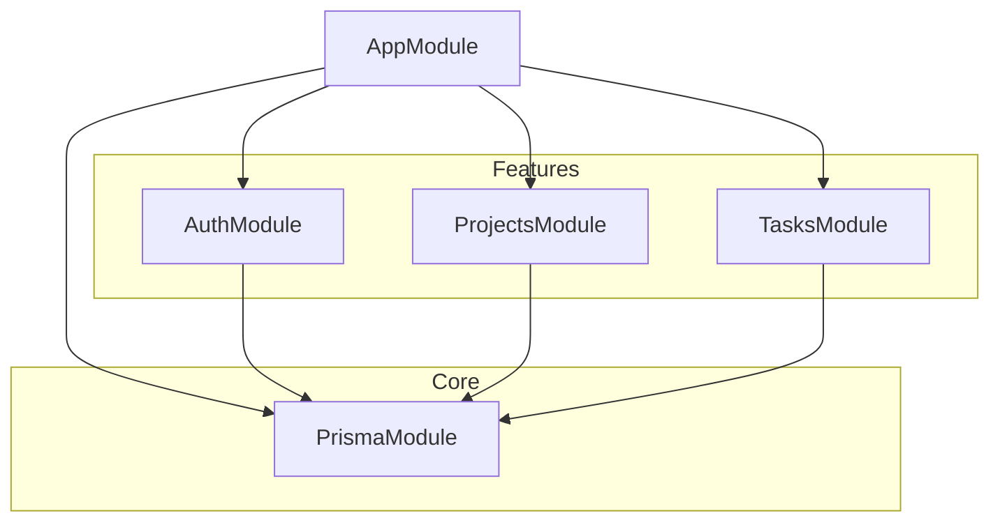

# Arquitectura del Sistema

El proyecto está construido sobre **NestJS**, siguiendo una arquitectura modular y orientada a servicios que facilita la escalabilidad y el mantenimiento.

## Capas de la Aplicación

### 1. Capa de Controladores (Controllers)
Encargada de recibir las peticiones HTTP, validar la entrada mediante DTOs y devolver las respuestas correspondientes. No contiene lógica de negocio.

*   **Ubicación**: `src/modules/*/controllers/*.controller.ts`
*   **Responsabilidad**: Enrutamiento, Seguridad (Guards) y Documentación (Swagger).

### 2. Capa de Servicios (Services)
Contiene la lógica de negocio y coordina las operaciones entre la base de datos y los controladores.

*   **Ubicación**: `src/modules/*/services/*.service.ts`
*   **Responsabilidad**: Lógica de aplicación, procesamiento de datos.

### 3. Capa de Persistencia (Prisma / Database)
Gestiona la comunicación con PostgreSQL a través de Prisma ORM.

*   **Ubicación**: `src/prisma/` y `prisma/schema.prisma`
*   **Responsabilidad**: Mapeo objeto-relacional, migraciones y consultas.

## Diagrama de Módulos



## Estructura de Carpetas

```text
src/
├── modules/
│   ├── auth/         # Autenticación, JWT, Pasaporte
│   ├── projects/     # Gestión de proyectos
│   └── tasks/        # Gestión de tareas
├── prisma/           # Servicio global de base de datos
├── common/           # (Opcional) Decoradores, filtros, interceptores
└── main.ts           # Punto de entrada
```
