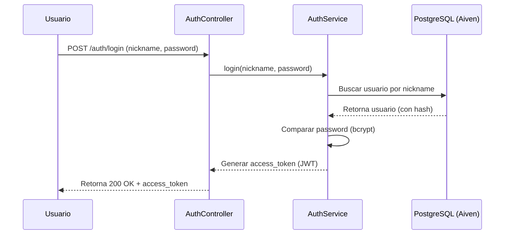
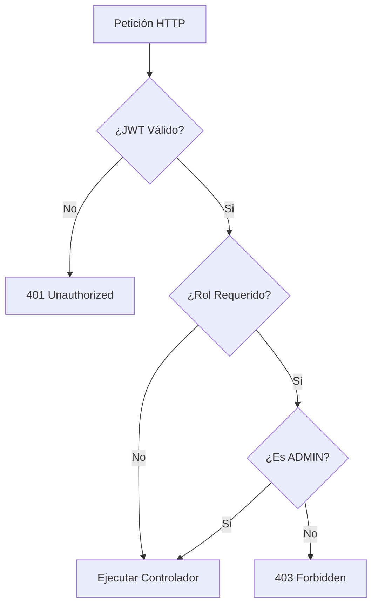
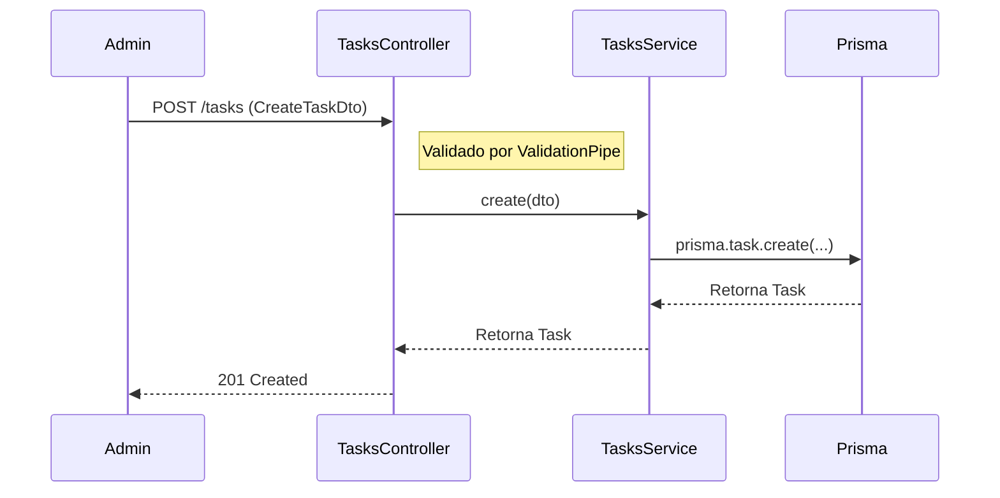

# Flujos de Datos

A continuación se describen los flujos principales del sistema.

## 1. Flujo de Autenticación (Login)

El sistema utiliza JWT (JSON Web Tokens) para mantener el estado de la sesión de forma stateless.

## 2. Flujo de Autorización (RBAC)

El acceso a los recursos está protegido por roles. Solo el rol `ADMIN` puede realizar cambios (escritura/borrado).

## 3. Flujo de Gestión de Tareas

